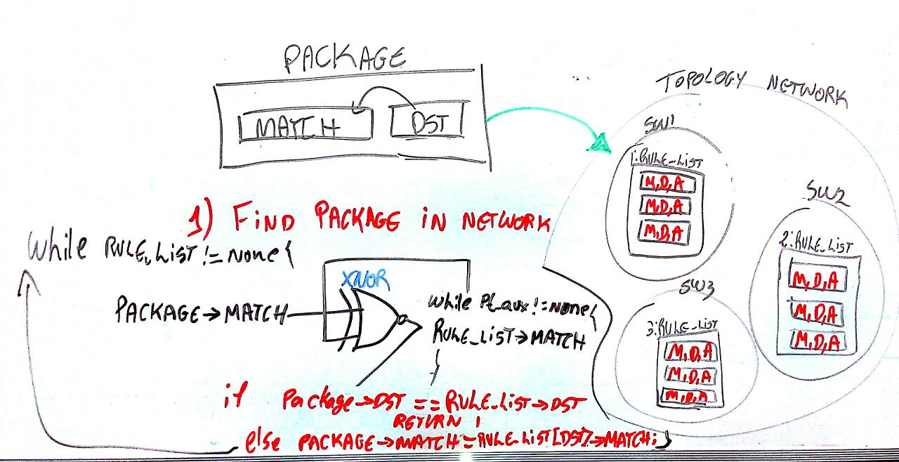

# Placidus: A Platform of formal verifiCation in software defined networks
__Autor:__ Levindo Gabriel Taschetto Neto

The Placidus is a formal verification platform for Software Defined Networks (SDN), and it has two modules that check the following properties: Conflicts and Redundancies logical rules formed from a network topology, and Reachability in a network topology.

## Reachability verifier 

### Data Structure
http://prntscr.com/cixbjh

### Algorithm Proposed for the Verification of Reachability with the Graph Approach

### Network topology for the tests

### Steps of execution:
1) Search by rule of the package match, using bitwise XNOR comparison between BitVector generated by make_test to the rule and BitVector RuleId [0], which are the Matches referring to a rule of the rules contained in the network topology.

2) Depois de achar no match, com o id salvo, procura junto com o list[id][dst] nas outras listas, e vai fazendo o caminho até terminar. É busca em largura porque vai sempre procurando lista até achar algo, daí percorre naquilo e assim vai indo (http://prntscr.com/cdtx2q), sempre utilizando o dst. Não precisa colocar que o pacote só precisa ter vindo de tal lugar, porque essa informação rule[5] é obtida pelo bitvectot do match.

