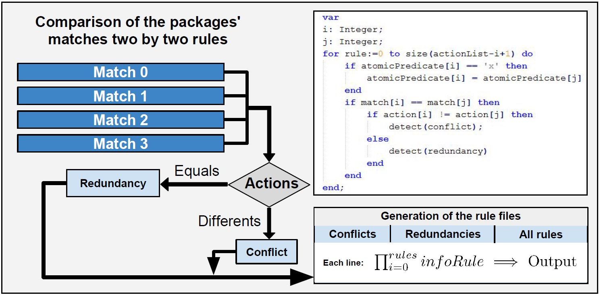

# Placidus: A Platform of formal verification in software defined networks
__Author:__ Levindo Gabriel Taschetto Neto

Placidus is a formal verification platform for Software Defined Networks (SDN), and it has two modules that check the following properties: Conflicts and Redundancies logical rules formed from a network topology, and Reachability in a network topology.


## Conflicts and Redundancies Verifier

A conflict between two rules is detected when two rules have the same match (Packet forwarding data) and different actions (outputs).

A redundancy between two rules is detected when two rules have the same match (Packet forwarding data) and the same actions (outputs).

The data structure utilized was a list of rules.

The algorithmic for the verification module of the properties of conflicts and redundancies in SDN can be see in the image below.



## Reachability Verifier 

The reachability is verified when:

Given a package by a source address, it can arrive in its destination in a right way, without lose itself in the network topology.

The data structure utilized was a BitVector graph of rules.

The algorithmic for the verification module of the properties of conflicts and redundancies in SDN can be see in the image below.


### Steps of execution:
* The input package is converted to a vector of bits, using the method makeTest of class bitVectorUtils.

* Package enters in the topology network graph, the search is made by a iterative bitwise comparison, that is made by a XNOR gate between the package->match and the matches of node->rule_list->match (This node is a graph vertice that contains informations about a rule, these informations are match, destination, switch, action and visited of the node.

* The link between switches and hosts is made with the method getLink of de class bitVectorUtils. This method returns a list where the switches are used as a index and the values of each index are the hosts.

* The following lists is obtained by the reading of the CSV file that contains the rules of the software defined network:
```python
classBitList.switchList    # This list contains only information about switches according the network topology {switch : rule}
classBitList.switchMatch   # This list is used for to link match and switches of network topology
classBitList.dstList       # This list contains only information about destination of packages in the network
classBitList.actionList    # This list contains only information about actions of predicates with the same index of the match informations
classBitList.theSwitchList # List of switches in the network topology
```
This lists is used to put informations at the nodes of the network topology graph.


* The reachability property is tested by a graph search at the topology network. One more information was added to the nodes of the graph of topology network, the visited information. This information is one of the informations used as a stop condition of breadth-first search that is made to verify if the package come in its destination of correct way.

### Network topology for the tests


### Mininet commands

#### Start the mininet in the linux terminal
```terminal
ssh -X mininet@VM_IP
```
#### Clear the network
```terminal
sudo mn -c
```
#### Copy source-destiny
```terminal
scp user@IP:/source_address/file.format /destiny_address
```

### Floodlight commands
#### Install the Floodlight Controller
```terminal
cd /address/z3-master  (Just in the first time)
cd ~/floodlight
sudo ant               (Just in the first time)
java -jar target/floodlight.jar
```
#### Catch Rest Api informations from floodlight
```terminal
curl -s http://143.54.12.11:8080/wm/core/controller/switches/json
```
The informations of the network are in the: 
http://Ip:Port/ui/index.html

### Firewall
### Delete a Rule
```terminal
curl -X DELETE -d '{"ruleid":RULE_ID}' http://Ip:Port/wm/firewall/rules/json
```
### Add a Rule
``` terminal
curl -s -d '{"switch":"00:00:00:00:00:00:00:02","ether-type":"0x0800","name":"flow-mod-5","nw_proto":"50","priority":"1","eth_src":"00:00:00:00:00:04","eth_dst":"00:00:00:00:00:02"}' http://Ip:Port/wm/staticflowpusher/json
```
### See all Rules
``` terminal
curl http://Ip:Port/wm/staticflowpusher/list/all/json
```
