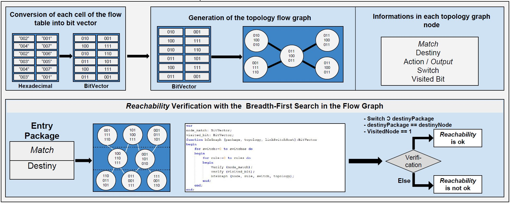

# Placidus: A Platform of formal verification in software defined networks
__Author:__ Levindo Gabriel Taschetto Neto

Placidus is a formal verification platform for Software Defined Networks (SDN), and it has two modules, which check two properties.
The verified properties are: 
*  Conflicts and Redundancies logical rules formed from a network topology.
*  Reachability in a network topology.


## Steps of the Network Creation

* Build up the topology using the Mininet Emulator.

* Catch the JSON File, which represents the topology, generated by Floodlight Controller.

* Manipulate the JSON file for generating a CSV flow table. 


## Conflicts and Redundancies' Verifier

A conflict between two rules is detected when two rules have the same match (packet forwarding data), and different actions (outputs).

A redundancy between two rules is detected when two rules have the same match and the same actions (outputs).

The used data structure is a list of rules.

The algorithm for the properties of conflicts and redundancies' verification module can be seen in the image below.


**Python needed version:** 2.7

## Reachability's Verifier 

The reachability property is validadeted when:
Given a package by a source address, it can arrive in its destination in a right way, without losing itself throughtout the network topology.

The used data structure is a BitVector graph of rules.

The algorithm for the verification module of reachability in SDN is shown in the following image.



**Python needed version:** 3.6+

### Steps of execution

* The input package is converted into a vector of bits, using the method `makeTest` of the class `bitVectorUtils`.

* The Package enters in the topology network's graph. Then, the fetch is done by an iterative bitwise comparison, which uses an XNOR gate with inputs given by `package->match` and the matches of `node->rule_list->match`. This node is a graph vertice, which contains information about a rule. These set of information are match, destination, switch, action and visited of each node.

* The link between switches and hosts is done using the method `getLink` of the class `bitVectorUtils`.
This method returns a list, in which the switches are used as indexes, and the values of each index are used as hosts.

* The following lists are obtained by the reading the CSV file which contains the rules of the software defined network:
```python
classBitList.switchList    # This list contains only information about switches according to the network topology {switch : rule}
classBitList.switchMatch   # This list is used for binding matches and switches of the network topology
classBitList.dstList       # This list contains only information about the destination of packages throughout the network
classBitList.actionList    # This list contains only information about the predicates' actions with the same index of the fetched match
classBitList.theSwitchList # List of switches in the network topology
```

These lists are used to put information at the nodes of the network topology graph.

* The reachability property is tested by a search in the network topology's graph. 
One more information has been added to the graph's nodes of the topology network, which is the visited information. 
This information is one of the ones used as stop condition of breadth-first search, which is done in order to verify whether the package reaches its destination in a correct way.

### Network topology for the tests


### Mininet's commands

#### Start Mininet in a unix terminal
```terminal
ssh -X mininet@VM_IP
```

#### Clear the network
```terminal
sudo mn -c
```

#### Copy from a source into a destiny
```terminal
scp user@IP:/source_address/file.format /destiny_address
```

### Floodlight's commands
#### Install the Floodlight Controller (Windows)
```terminal
cd /floodlight
ant
java -jar target/floodlight.jar
```

A tutorial on how to install *ant* on Windows may be found [here](https://mkyong.com/ant/how-to-install-apache-ant-on-windows)

The port that floodlight is set to run within this project is **8010**, so the web gui can be accessed from [http://dawntech.brazilsouth.cloudapp.azure.com8010/ui/pages/index.html](http://dawntech.brazilsouth.cloudapp.azure.com8010/ui/pages/index.html).


```
#### Catch Rest Api information from floodlight
```terminal
curl -s http://143.54.12.11:8080/wm/core/controller/switches/json
```
The information of the network are in the: 
http://Ip:Port/ui/index.html

### Firewall

### Delete a Rule
```terminal
curl -X DELETE -d '{"ruleid":RULE_ID}' http://Ip:Port/wm/firewall/rules/json
```

### Add a Rule
``` terminal
curl -s -d '{"switch":"00:00:00:00:00:00:00:02","ether-type":"0x0800","name":"flow-mod-5","nw_proto":"50","priority":"1","eth_src":"00:00:00:00:00:04","eth_dst":"00:00:00:00:00:02"}' http://Ip:Port/wm/staticflowpusher/json
```
### See All Rules
``` terminal
curl http://Ip:Port/wm/staticflowpusher/list/all/json
```
